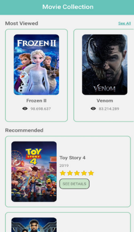
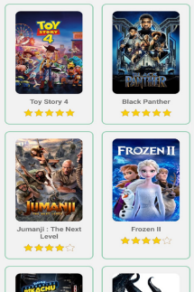
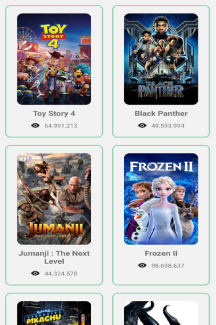
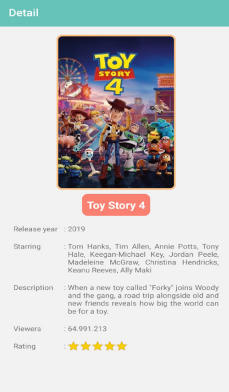

# Personal Movie Collection Mobile App 🎥

(Note: This project was made in 2024, but I decided to upload it to GitHub in 2026 to keep it safe :D)

During my app dev journey, I had a weird obsession with movie reviews. Because of that, I wanted to create a React Native mobile application for browsing a personal collection of movies. Users can explore recommended and top-rated films, view movie posters, and navigate to dedicated detail pages containing additional information about each title.

The movie data used throughout the application was created manually rather than pulled from an external API, allowing me to focus on application structure, navigation, and data handling.

## Features

* Browse a collection of movies
* View movie posters and cover images
* Explore recommended movies
* Explore top-rated movies
* Navigate between multiple screens
* View detailed information for each movie
* Mobile-friendly user interface built with React Native

## Screens

### Home Screen

The main entry point of the application, providing access to the movie collection and different categories.

### Recommended Movies

Displays a curated list of recommended movies.

### Top-Viewed Movies

Shows the movies with the most views in the collection.

### Movie Details

Provides additional information about a selected movie, including its description and other relevant details.

## Technologies Used

* React Native
* JavaScript
* React Navigation
* React Native Components and Styling

## What I Learned

This project helped me gain a deeper understanding of React Native and mobile application development. Some of the concepts I explored include:

* Navigation between multiple screens
* Organizing React Native components
* Managing and displaying structured data
* Sorting movie data into different categories
* Building more complex application layouts
* Improving code organization and project structure

Looking back, this project was an important step in moving beyond simple applications and becoming more comfortable building larger React Native projects.

## Setup 

```bash
npm install
```

Run the application using the React Native CLI and an Android emulator:

```bash
npx react-native run-android
```

## Screenshots

### Home Screen



### Recommended Movies



### Top-Viewed Movies



### Movie Details



## Acknowledgements

This project was developed as part of a React Native learning course. While some starter files were provided, the application logic, landmark dataset, and overall implementation were developed by me as part of the learning process.
- [Getting Started](https://reactnative.dev/docs/environment-setup) - an **overview** of React Native and how setup your environment.
- [Learn the Basics](https://reactnative.dev/docs/getting-started) - a **guided tour** of the React Native **basics**.
- [Blog](https://reactnative.dev/blog) - read the latest official React Native **Blog** posts.
- [`@facebook/react-native`](https://github.com/facebook/react-native) - the Open Source; GitHub **repository** for React Native.


